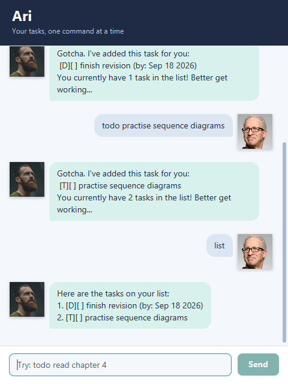

# Ari User Guide

Ari keeps todos, deadlines and events in one desktop list. Type a command and
press Enter or click **Send**.

## Quick start

1. Install Java **25**; check that `java -version` reports version 25.
2. Download the single `ari.jar` asset from the release you intend to use on
   [the releases page](https://github.com/Henry336/ip/releases).
3. Put it in a writable folder. Open a terminal there and run `java -jar ari.jar`.
4. Try `todo read the user guide`, then `list`.

This guide describes the Week 6 implementation. Until that release is published,
older releases may behave differently. Developers can build this version with
`./gradlew clean shadowJar` (Windows: `gradlew.bat clean shadowJar`) using Java 25.
The artifact is `build/libs/ari.jar`.

## Commands

Command words ignore case. Surrounding and repeated whitespace are accepted.
Replace angle-bracket placeholders with your text; do not type the brackets.

| Command | Example | Result |
|---|---|---|
| `todo <description>` | `todo read chapter 5` | Adds an incomplete todo. |
| `deadline <description> /by <time>` | `deadline submit report /by 2026-09-18` | Adds a deadline. |
| `event <description> /from <start> /to <end>` | `event revision /from Monday 2pm /to Monday 4pm` | Adds an event. |
| `list` | `list` | Shows all tasks in their current order. |
| `find <keyword>` | `find chapter` | Finds descriptions containing the text, ignoring case. |
| `mark <ID>` | `mark 1` | Marks the task at that position complete. |
| `unmark <ID>` | `unmark 1` | Marks it incomplete again. |
| `delete <ID>` | `delete 1` | Removes that task. There is no undo command. |
| `sort` | `sort` | Saves alphabetical order by description, ignoring case. |
| `bye` or `exit` | `bye` | Closes Ari. Accepted changes are already saved. |

`list`, `sort`, `bye` and `exit` take no arguments. ID commands take exactly one
integer. Use `todo`, `deadline` or `event`, not `add`.

### Task types and IDs

`[T]` means todo, `[D]` deadline, `[E]` event. `[X]` means complete; `[ ]` means
incomplete. IDs start at 1 and follow the full-list order. Deleting or sorting
can change IDs, so run `list` before another ID command.

**Find results are numbered within the matches, not the full list.** Before
marking or deleting a found task, use `list` to get its current full-list ID.

Sorting is stable: equal lowercase descriptions retain their relative order.
New tasks append until you sort again. Comparison is lexicographic after
lowercase conversion, not natural-number or language-specific dictionary
ordering. Duplicate tasks are allowed.

### Dates and field restrictions

- A valid ISO date such as `2026-09-18` displays as `Sep 18 2026`.
- An impossible ISO-shaped date such as `2026-02-30` is rejected.
- Free-form text such as `next Friday` is preserved. Ari does not interpret
  reminders, time zones or natural-language chronology.
- If both event endpoints use `YYYY-MM-DD`, the end must be strictly after the
  start. For a same-day event, use meaningful free-form times instead.
- Separator tokens are lowercase and standalone: `/by` once for deadlines;
  `/from` then `/to`, once each, for events. These reserved tokens cannot also
  occur inside deadline/event fields. Required fields cannot be empty.
- Task fields cannot contain `|` or line breaks because those delimit stored
  records. There is no escaping syntax for them.

For example, `deadline revise assertions /by 2026-09-18` adds a task and confirms
the count. Using `2026-02-30` instead reports an error without adding anything.
Existing saved free-form dates are preserved, not silently migrated.

## Saving and closing

Every accepted add, mark, unmark, delete or sort is saved immediately. A success
response means the save completed. A failed save rejects the command and keeps
the previous list in memory and on disk. Fix the storage problem and retry.
Closing the window, `bye` and `exit` do not perform another overwrite. The
console also exits safely at end of input.

The file is `data/ari.txt` relative to the **working directory from which Ari
was launched**, not necessarily the JAR's folder. Launch from the same folder
to use the same list. Use only one running instance per file; concurrent writers
are not coordinated. Close Ari and back up the file before manual editing.

## Troubleshooting

| Symptom | Recovery |
|---|---|
| `Storage is protected` at startup | Close Ari, back up the original file, repair the indicated record or restore a known-good backup, then restart. The protected session will not overwrite the original. |
| `I couldn't save this change` | Nothing changed. Check folder permissions, disk space and file locks, then retry. |
| Atomic replacement unsupported | Use a writable local filesystem supporting atomic replacement. Ari will not fall back to truncating the old file. |
| ID does not exist | Run `list` and use a current full-list ID. |
| List appears empty after another launch | Check the working directory and startup message before modifying files. You may be using a different task file. |
| JAR does not start | Check Java 25, run from a terminal to read the error, and verify the download/build completed. |

GUI errors have a `Please check:` text cue and contrasting reply color. Correct
input and continue, except protected storage requires repair and restart.
Whitespace-only submissions are ignored.

## Limitations and feedback

No reminders, cloud sync, undo, persistent IDs or multi-instance coordination
are provided. Atomic replacement avoids partial file replacement on supported
filesystems; it is not a guarantee against all power-loss events. Platform
compatibility must be checked with the actual release artifact.

When reporting a problem, include OS, Java version, exact command, expected and
actual behavior, and release version. Do not publish private task data.
